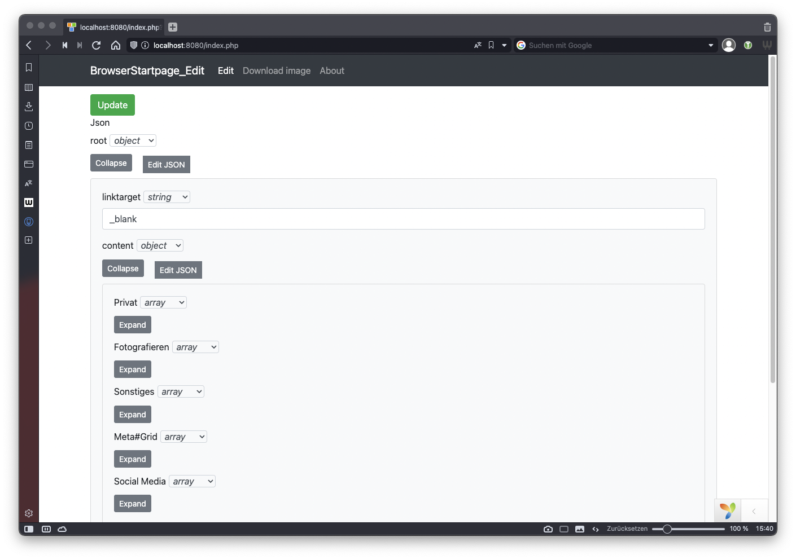
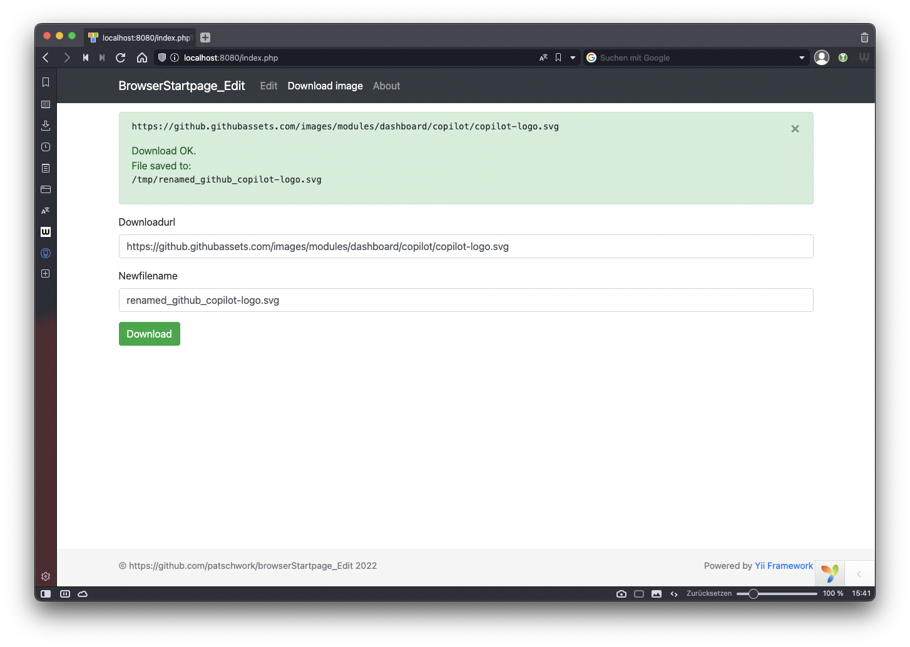

# browserStartpage_Edit
Web UI for edit content (data.json) for the tool browserStartpage (GitHub: https://github.com/saschadiercks/browserStartpage)

# Why
I wanted to be able to edit the data.json and to download images for the items more comfortable.

# Tech-Stack
- Yii2 framework
- Yii2 extension dmstr/yii2-json-editor

# Screenshots



# Install
You need to have setup PHP and composer

Open a cmd-shell (actually only Linux and Mac was used)
```sh
cd <folder_you_want>

# Get vanilla Yii2
composer create-project --prefer-dist yiisoft/yii2-app-basic browserStartpage_edit

# Get extension
cd browserStartpage_edit
composer require --prefer-dist dmstr/yii2-json-editor "*"

# Change to a temp folder
cd /tmp

# Clone this repo
git clone https://github.com/patschwork/browserStartpage_Edit.git browserStartpage_Edit_github_tmp

# Copy + overwrite the content (controller, views, ...)
cd browserStartpage_Edit_github_tmp
cp -R * <folder_you_want>/browserStartpage_edit/
```

